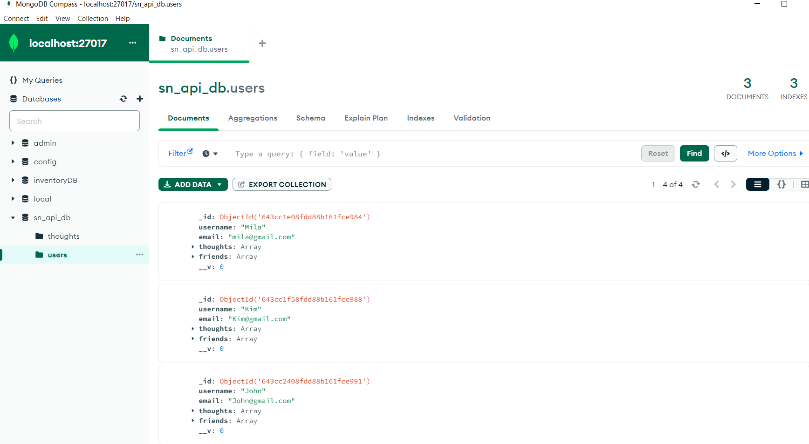
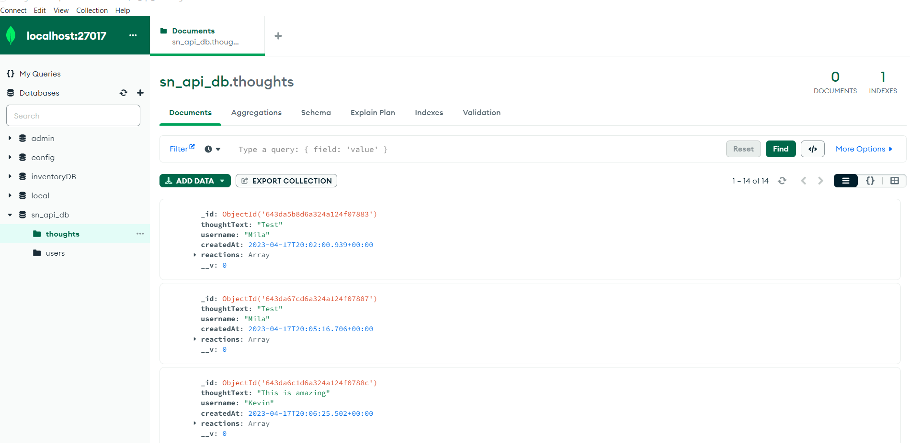
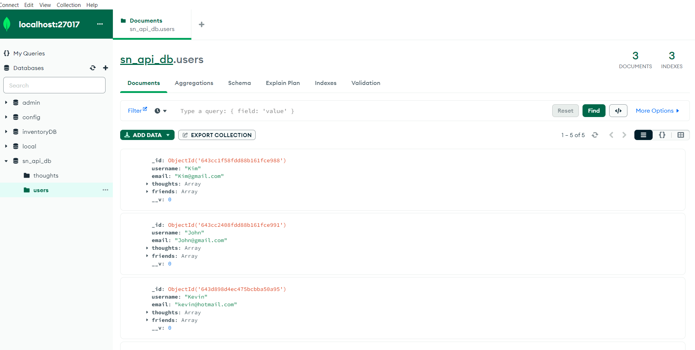

# Social-Network-API

## _Table Of Contents_

1. [Description](#description)
2. [Installation](#installation)
3. [License](#license)
4. [User Story](#user-story)
5. [Criteria For Assignment](#criteria-for-assignment)
6. [Repo Link](#repository-link)
7. [Screen Shots](#screen-shots)

## Description

API for a social network web application where users can share their thoughts, react to friends’ thoughts, and create a friend list.

## Instalation

You will need to install node packages

## License

MIT
_Website for license_

[MIT License Website](https://mit-license.org/)

## User Story

AS A social media startup
I WANT an API for my social network that uses a NoSQL database
SO THAT my website can handle large amounts of unstructured data

## Criteria for the assignment

_When I am given a social network APLI_
**WHEN I enter the command to invoke the application**

**THEN my server is started and the Mongoose models are synced to the MongoDB database**

_WHEN I open API GET routes in Insomnia for users and thoughts_

**THEN the data for each of these routes is displayed in a formatted JSON**

_WHEN I test API POST, PUT, and DELETE routes in Insomnia_

**THEN I am able to successfully create, update, and delete users and thoughts in my database**

_WHEN I test API POST and DELETE routes in Insomnia_

**THEN I am able to successfully create and delete reactions to thoughts and add and remove friends to**

## Repo Link

[RepoLink](https://github.com/siahmoymajid/social-network-api)

## Screenshots

## Note

worked with a tutor and aso used ASKBCS
